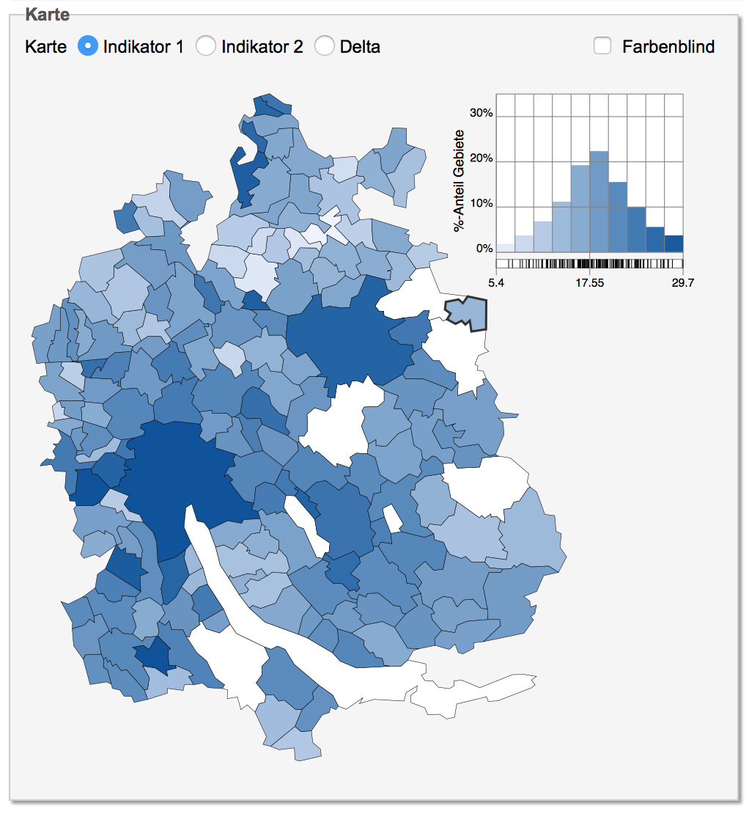

# PHBS_MLF_2018

## Project
Predict the outcome of elections in the Swiss Canton of Zurich 

## Members
Joel Gysel, 221802010272

## 1 Introduction 
Switzerland is divided into 26 states called "Cantons". Zurich is the most populous canton of Switzerland and it consists of 166 municipalities. Every four years, elections take place in Zurich. In Switzerland there are typically two left-wing parties and three centrist or right-wing parties. 

The aim of this project is to predict weather the two left-wing parties will reach a voters share above a ceratin threshold (e.g. 33%) within a municipality during an election or not based on factors such as population density, share of foreigners, median income, religion and further factors. 

## 2 Data description
All relevant data can be retrieved from https://opendata.swiss/de/. The data series starts in 1995 and cover six elections. If possible, the goal is to implement an API such that data can be retrieved automatically. 

## 3 Methodology 
After importing and preparing the data, different selection mechanisms will be applied to test which factors should be used for the prediction and to reduce the dimensionalty of the data frame. 

In a second step, different machine learning models will be applied and tested to the data. 
