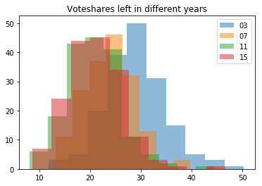

# PHBS_MLF_2018

## Project
Predict the outcome of elections in the Swiss Canton of Zurich 

## Members
Joel Gysel, 221802010272

## 1 Introduction 
Switzerland is divided into 26 states called "Cantons". Zurich is the most populous canton of Switzerland and it consists of 166 municipalities. Every four years, elections take place in Zurich. In Switzerland there are typically two left-wing parties and three centrist or right-wing parties. 

The aim of this project is to predict weather the two left-wing parties will reach a voters share above a ceratin threshold (e.g. 33%) within a municipality during an election or not based on factors such as population density, share of foreigners, median income, religion and further factors. 

## 2 Data description
All relevant data can be retrieved from https://opendata.swiss/de/. The election data starts in 1995 and covers six elections. However, most explanatory variables are only available for the elections 2003, 2007, 2011 and 2015, therefore we focuse our analysis on those four elections.

The explained variable is voteshare, which consists of the combined party strength (share of votes) of the three parties "Sozialdemokratische Partei (SP)", "Grüne Partei (GP)" and "Alternative Liste (AL)". Those three parties are forming the left wing in the Kanton of Zurich. 

The explanatory variables are:

Feature |Description
-------|---------
children_ratio	| Population between 0 and 18 years divided by population between 18 and 64
participation	| Participation in election in %
foreigners	| Share of foreign people compared to whole population 
population_density	| Population density within a district
voteshare_past | Share of votes of left-wing parties in last election

The following explanatory variables will or can be added: 

Feature |Description
-------|---------
national_trend	| National trends in voteshare prior to the Zurich election 
median_income	| Median income

## 3 Methodology
### The problem 
Explanatory variables are weak except for voteshare_past and national_trend. 

### The idea 
1. Standardize the data by deducting the mean voteshare in each year 
2. Apply machine learning methods to demeaned data 
3. Add the mean to the data again to get a prediction for the actual voteshare 

## 4 Standardize the data 
### Data before deduction of mean 

fligner-killeen test|-
--------------------|---------
test statistic      | 2.067
P-value	            | 0.5585

### Data after deduction of mean 

## 5 Apply ML method to continuous output variable 
### Linear Regression 

In a lasso-regression, all explanatory variables except for the outcome of the last election would most likely drop out. However, the multivariate regression model performs equaly well or slightly better than the univariate model, thus we keep all explanatory variable. Our goal is only to predict and not to assess causalities therefore we do not need to pay attention to multicolinearity. 

 -- | R^2 multivariate|R^2 univariate
----|---------|---------
2003|	0.871678|	0.867476
2007|	0.811515|	0.801090
2011|	0.857416|	0.841881
2015|	0.928868|	0.923352

### Decision tree Regression 
On of two methods described in the book to predict a continuous outcome. 

As it can be seen from the graph, the decision tree regression is not optimal in this case since the demeaned outcome of the last and this election is almost perfectly linear. 

## 5 Apply ML method to discrete output variable 
### Logistic regression 

Illustration of the problem of weak explanatory variables: Feature "foreigners" has almost no impact on decision boundary. Furthermore, the error of missclassified samples seems to nonsystematic (= random). 

Multivariate regression performs slightly better than univariate regression. Positive trend is probably random. 

### Decision Tree
Optimal depth: 

A depth of 5 leaves seems to be optimal for the decision tree

Accuracy: 

Multivariate regression is slightly better than univariate regression. However, performance over time is decreasing and overall performance is bad. 

### KNN
Optimal depth: 

Difficult to determine optimal depth, needs some further testing through cross-validation. Our choice for now: 5 neighbours. 

Accuracy: 

As expected is the univariate model in this case better than the multivariate one. 

## 6 Conclusion 
* Predicting elections is similar as predicting stock prices: Today's outcome of elections is the best predictor for future outcomes and once we account for the change in the mean, differences in voteshares are almost random. 
  * Possible explanations: 
      * Humains are involved and humains behave irrational and unpredictable 
      * Shares of votes is largely dependent on candidates. A voter's attitude towards a candidate is very difficult to measure 
* A multivariate model can still improve the model, even if only by a small percentage 
  * In case of a continuous output variable, we should prefer the linear regression model over the decision tree regression
  * In case of a discrete output variable, we should chose the logistic regression: Best accuracy and best robustness
* Further explanatory should be tested for their predictive power
  * Possible variables: 
    * Sentiment analysis in social media 
    * Some explanatory variables on candidates

