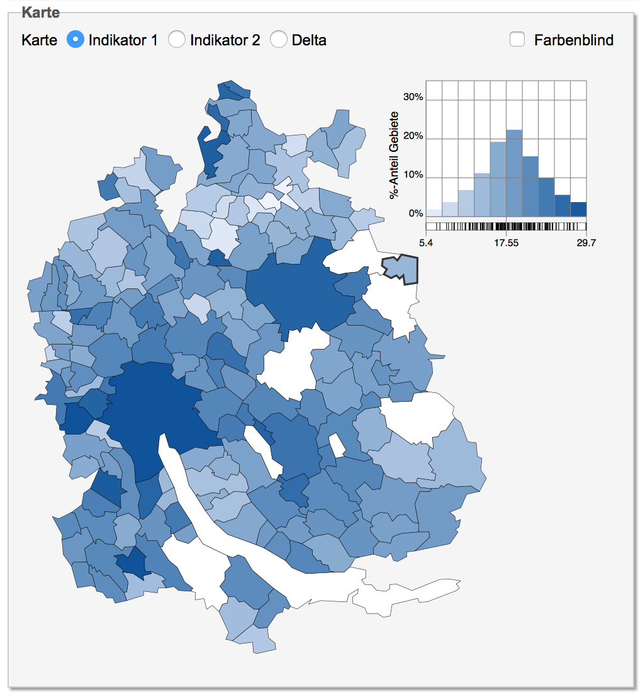
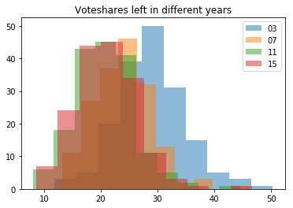
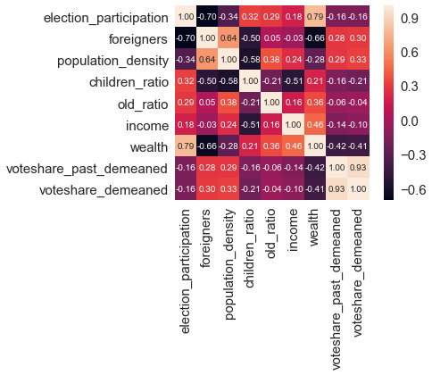

# PHBS_MLF_2018

## Project
Predict the outcome of elections in the Swiss Canton of Zurich 

## Members
Joel Gysel, 221802010272

## 1 Introduction 
Switzerland is divided into 26 states called "Cantons". Zurich is the most populous canton of Switzerland and it consists of 166 municipalities. Every four years, elections take place in Zurich. In Switzerland there are typically two or three left-wing parties and three centrist or right-wing parties. 

The aim of this project is first to predict the share of votes that the three left-wing parties combined in Zurich will reach in the next election and second to define a threshold and assess the effectiveness of machine learning classifiers in predicting wheather the left-wing parties will reach a voteshare above this threshold or not. 

## 2 Data description
All relevant data can be retrieved from https://opendata.swiss/de/. The election data starts in 1995 and covers six elections. However, most explanatory variables are only available for the elections 2003, 2007, 2011 and 2015, therefore I focuse my analysis on those four elections.

The explained variable is voteshare, which consists of the combined party strength (share of votes) of the three parties "Sozialdemokratische Partei (SP)", "Grüne Partei (GP)" and "Alternative Liste (AL)". Those three parties are forming the left wing in the Kanton of Zurich. 

The explanatory variables are:

Feature |Description
-------|---------
children_ratio	| Population between 0 and 18 years divided by population between 18 and 64
participation	| Participation in election in %
foreigners	| Share of foreign people compared to whole population 
old_ratio	| Population above 65 divided by population between 18 and 64
social_aid	| Number of unemployed people who receive social aid
income	| Median income 
wealth	| Median wealth (net assets) 
population_density	| Population density within a district
voteshare_past | Share of votes of left-wing parties in last election

Not included in the data frame but still a very important variable is the variable lucerne. As we can see in the graph below, the outcome of the Zurich election follows usually the trend of elections prior to the Zurich election. The canton of Lucerne has its election just a few month before the Zurich election takes place and if the left-wing parties are losing votes in Lucerne, it is very likely that the same will happen in the Zurich elections. By including the percentage changes in voteshare from Lucerne, I aim to further improve our model. 

## 3 Predict continuous output variable 
### Regression
#### Regression with absolute values
Before I start running regressions with multiple explanatory, I want to run a very sparse model with just one explanatory variable: The outcome of the last election. This sparse model will further be called "univariate". This simple model helps to demonstrate the problem with absolute values. 

The graph above is used to evaluate the performance of this simple regression and of all future models. The y-axis shows the R^2 in case of a regression or the score in case of a classification. The x-axis shows, what I evaluate. The 2003 data point will always be the performance of the model within the train-dataset (2003). The years 2007 to 2015 represent a cross-validation with either fitting on just the precedent election or fitting based on all precedent elections. 

Let us first have a look at the blue line: Here I fit the outcome of the 2003 election to the outcome of the 1999 election and use the coefficients to make an out-of-sample prediction for the 2007 election (same mechanism for the following years). This model performs very poorly with even a negative R^2 in 2007. Due to the very poor performance, I was tempted to test a second model: I fitted the 2003 outcome on the 2003 outcome such that I had a model with an intercept of zero and and a beta coefficient of 1 (this model will be called zero/one). Testing this model in a forecast basically means to use the outcome of the last elections as the prediction for the next election. This model, even though performing a bit better, still performs very bad, so past elections do not seem to contain a lot of information about future elections (similar as financial data). 

#### Regression with relative values
To improve my model, I now start working with relative values. The idea: if I transform my data, models will likely perform much better. I can apply regressions and classifiers to relative data and then transform the data back to absolute values such that I get a better forecast of the outcome of elections. 

If I would transform the data s.t. it follows standard normal distribution, I would have problems transforming the data back since I have no information about the variance. However, if I only deduct the mean from "voteshare", I can apply regressions and classifiers to relative data and then add the mean and the percentage change from the election of Lucerne to the predicted values in order to get back to absolute values (and hopefully better absolute values). 

However, if I only deduct the mean from the data, I have to make sure that the variance is comparable in each election year, otherwise my models will be missleading. To test the null-hypothesis of equal variance, I apply the fligner-killeen test to the voteshare of my four election years: 

fligner-killeen test|-
--------------------|---------
test statistic      | 2.067
P-value	            | 0.5585

Luckily, we get a p-value of over 0.55 which means that we cannot reject the null-hypothesis of equal variance in the election years. Given this result, I am now deducting the mean within each election year. The two histogramms below show the data before and after the transformation: 

Now I run the same regressions again as before, but this time I use relative values: 

The accuracy of my model is much better now. This means: If I can predict the change in mean by making use of election data from the canton of Lucerne, it should be possible to improve my model. A second observation of the above graph is that the zero/one model is still performing better than a fitted model. Next, I will try to improve the fitted model by making the fit not just based on the last election but on all last elections, which means that my dataset for fitting is growing over time. 

As we can see in the graph, in 2003 (train accuracy) and 2007 (first out-of-sample-prediction), this approach will lead to the same results as the fitted model before since the dataset only starts to be bigger from 2011 onward. For 2011 and 2015, this fitted model performs better than before but still worse than the zero/one model. 

#### Regression with multiple explanatory variables

Next, I will try to run a multivariate regression that includes all explanatory variables. I will provide a short example to provide the idea behind the multiple regression: If during the fit stage our model learns, that a higher share of foreign people leadst to a significantly higher voteshare for the left-wing parties, then it will predict a higher voteshare if the percentage of foreigners increased in a community from one election to the other, making the model more accurate. Let us see, how well a multiple regression performs: 

In case of our zero/one model, there is almost no difference in the R^2 of a multivariate model compared to our univariate model before with voteshare_past as the only explanatory variable. In case of our model "last election" that uses coefficients from a fit of secondlast to last election, the multivariate model performs even worse than the univariate model. Maybe this result is due to overfit. Let us asses the heatmap of all our coefficients: 

The last row is the output variable (voteshare_demeaned). As we would expect, voteshare_past_demeaned has by far the highest correlation with voteshare_demeaned. Other factors such as median wealth, percentage of foreigners and population density seem to have some explanatory power as well. We use those four factors and remove all other factors for a more sparse model. This new model with only four factors shows the following performance: 

As we can see, our results have not really improved compared to the full multivariate model. 

#### Regression: conclusion
Even though I have tested a lot of different models so far, it seems not to be possible to create a model that performs better than our simple zero/one model where I just use the outcome of the last election as the prediction for the next election. Given this result, I will now use the predicted values of the univariate zero/one model and add the mean back again plus a correction factor from the outcome of the election in Lucerne and test the performance of this model. The results can be found in the table below: 

 -- | R^2 before |R^2 after
----|---------|---------
2007|	-1.237 |	0.544
2011|	0.665 |	0.468
2015|	0.382 |	0.855

Our new R^2 of the predicted absolute values is still well below our R^2 with relative data. This is due to the fact that the outcome of the preceeding Lucerne election is not a precise forecast for the outcome of the Zurich election but rather an approximation. Our R^2 is lower because it is impossible to predict the change in mean exactly. Nevertheless, with our transformation to relative data and our backtransformation plus correction, we can overall reach a higher R^2 than before.

### Decision tree Regression 
A different method to predict a continuous output variable is the decision tree regression. I will shortly test this model in order to assess if it has a better performance than our best performing regression model (zero/one). 

As we can see, our decision tree regression performs worse than the zero/one model. The answer to this worse performance is found in the next graph: 

In our case, we have an almost linear relationship between the outcome of the last vote and the outcome of the current vote. As the plot shows, it is not suitable to use a decision tree regression in case of an almost perfect linear relationship. 

## 4 Predict discrete output variables 
As stated in the introduction, I will now assess the effectiveness of classifiers for a voteshare threshold. Threshold classifications for predicting the outcome of elections can be important if for example we want to predict if a party will reach a majority in a ceratin area (e.g. president elections in the U.S.) or if there is a minimum voteshare that a party must reach in order to receive seats in the parlament. In Zurich none of those two examples is especially relevant, therefore I define the threshold just as the median party strength of the left-wing parties. By defining the threshold this way, I avoid problems with an imbalanced dataset.  

### Logistic regression 

The first classifier tested is the logistic regression. Let us direclty jump to the results: 

Instead of the R^2, I now use the score (percentage of correctly classified observations) to evaluate my classifiers. Similar as before, the univariate model with the outcome of the last election as the only feature performs better in classifing than a multivariate model. Second, increasing our train dataset over time does not seem to add any benefit. 

I tried some more multivariate models by playing around with the number and selection of features. It turned out that a multivariate model with the two explanatory variables "foreigners" and "voteshare_past" performs better than a multivariate regression with the four most relevant factors (see feature selection above) and it also performs better than my simple univariate model: 

Does this mean that I finally found a model that performs better than just using the outcome of the last election as predictor for the current election? I doubt that this is the case. My approach of playing around with the number of factors could be described as "factor mining" and I fear that the variable "foreigners" just helped to improve the model within this very specific time range of 2003 to 2015. Let us have a lock at the decision boundaries: 

As we can see, the factor "foreigner" has almost no impact on the decision boundary, the predominant factor is by far the outcome of the last election. Therefore I doubt that the factor "foreigners" can actually improve my logistic regression classifier.  

### Decision Tree
Given my results from the logistic regression, I will only test the decision tree for the univariate model. The goal is to assess wheather the decision tree reaches a better performance than the logistic regression. 

Before I can start using the the decision tree, I need to determine the optimal maximal depth of my decision tree. Due to simplicity, I use a loop with a k-fold method on the whole dataset to assess the optimal depth even though I should usually avoid to apply k-fold methods to time series data. As we can see in the plot below, the model performs best for a depth of one or two. I will therefore use a max depth of two. 

The graph below shows the accuracy of the decision tree compared to the accuarcy of the logistic regression. The decision tree performs worse than the logistic regression. I was also running multivariate regressions on the decision tree (not part of the code) but the performance was in every case worse than the logistic regression. 

### KNN
Finally I want to test the performance of the KNN model. I will proceed in the same fashion as for the decision tree. The optimal number of neighbours can be derived from the plot below and is equal to three. 

As we can see in the plot below, the KNN model reaches a lower performance on the training set but a higher performance on all cross validations. In this project, where the outcome of voteshare seems to be quite random (given the mean is known), it looks as if the nonparametric KNN model works better than a parametric model, that has difficulties to caputre the randomness of the outcomes. 

## 5 Conclusion 
* Predicting elections is similar as predicting stock prices, given the efficient market hypothesis is true: Today's outcome of elections is the best predictor for future outcomes 
   * However, we can get closer to "today's outcome of elections" if we use data from recent elections in other areas. This more recent data can help us to improve our model. 
* Once we account for the change in the mean, differences in the strength of political parties between two elections are almost random. Possible explanations: 
    * Humains are involved and predicting humain behaviour is tricky
    * Shares of votes is largely dependent on candidates. A voter's attitude towards a candidate is very difficult to measure 
* A multivariate model does not help to improve our prediction and if it does, it is presumably due to luck. 
* In case of a continuous output variable, we should prefer the linear regression model over the decision tree regression due to the linear nature of our task. 
* In case of a discrete output variable, we should chose the KNN classifier which seems to deal better with the randomness of our data than a parametric model. 
